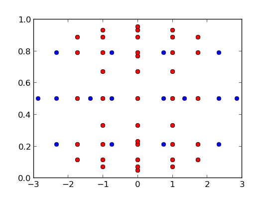

Heterogeneous Sparse Grids
--------------------------

This module is used to construct Heterogeneous Sparse Grids. These are integration rules based on Smolyak's Sparse Grids [6]_ built up in order to provide flexibility for both:
    #. the types of polynomials to be used per direction
    #. the accuracy to be used per direction

The types of polynomials available are all the ones included in the module :py:mod:`Spectral1D`. The rules don't need to be symmetric and the accuracy per each direction can vary.

For rules with Heterogeneous accuracy, two sparse grids will be construced: one partial sparse grid and one full sparse grid (up to the maximum accuracy). The values computed for the partial sparse grid can then be used to interpolate on the points of the full sparse grid. This latter rule can then be used to compute the integral.

References
^^^^^^^^^^
.. [6] S. A. Smolyak, "Quadrature and interpolation formulas for tensor products of certain classes of functions". Soviet Math. Dokl., 4:240–243, 1963

Examples
^^^^^^^^
Let's consider the following space :math:`\Omega = [-\infty,\infty]\times[0,1]` with the associated measures :math:`\mu_1(x)=\frac{1}{\sqrt{2\pi}} e^{-\frac{x^2}{2}}` and  :math:`\mu_2(x)=1` for each dimension. The product measure is given by :math:`\mu(\bar{x})=\prod_{i=1}^n \mu_i(x_i)`. We will consider the function

.. math:: f(\bar{x}) = x_1^{p_1} \cdot x_2^{p_2}

>>> f_mult = lambda x,y,xp,yp: x**xp * y**yp

with exact value of the integral given by

.. math:: \int_\Omega f(\bar{x}) \mu(\bar{x}) = \frac{2^{-1+p_2} \left( 1+(-1)^{p_2} \right) \Gamma\left( \frac{1+p_2}{2} \right)}{(1+p_1)\sqrt{\pi}}

>>> def I_mult(q,p):
>>>     return 2.**(-.5+.5*(-1.+q)) * (1.+(-1.)**q) * scipy.special.gamma((1.+q)/2.) / ((1.+p)*np.sqrt(np.pi))

Let :math:`p_1=2` and :math:`p_2=4`. We can obtain a sparse grid composed using Hermite basis (:py:const:`Spectral1D.HERMITEP_PROB`) and Legendre basis (:py:const:`Spectral1D.JACOBI`) with orders 2 and 4 respectively.

>>> from SpectralToolbox import HeterogeneousSparseGrids as HSG
>>> pH = Spectral1D.Poly1D(Spectral1D.HERMITEP_PROB,None)
>>> pL = Spectral1D.Poly1D(Spectral1D.JACOBI,[0.0,0.0])
>>> polys = [pH,pL]
>>> Ns = [2,4]
>>> sg = HSG.HSparseGrid(polys,Ns)
>>> (XF,W,X) = sg.sparseGrid()
[SG] Sparse Grid Generation [============================================] 100%
[SG] Sparse Grid Generation: 0.01s
>>> XF[:,1] = (XF[:,1]+1.)/2.
>>> X[:,1] = (X[:,1]+1.)/2.
>>> plt.figure()
>>> plt.plot(XF[:,0],XF[:,1],'o')
>>> plt.plot(X[:,0],X[:,1],'or')

The resulting partial and full sparse grids are shown in the following figure.

.. _GridExample:

    
    Partial (red) and full (blue) sparse grid. The full sparse grid is overlapping over the partial sparse grid.

The values on the partial grid can be computed and then the interpolation is taken over the full sparse grid.

>>> fX = f_mult(X[:,0],X[:,1],Q,P)
>>> fXF = sg.sparseGridInterp(X,fX,XF)
[SG] Sparse Grid Interpolation [=========================================] 100%
[SG] Sparse Grid Interpolation: 0.00s

Finally the error of the quadrature rule is

>>> IErr = np.abs(0.5*np.dot(fXF,W)-I_mult(Q,P))
>>> print IErr
3.33066907388e-16
